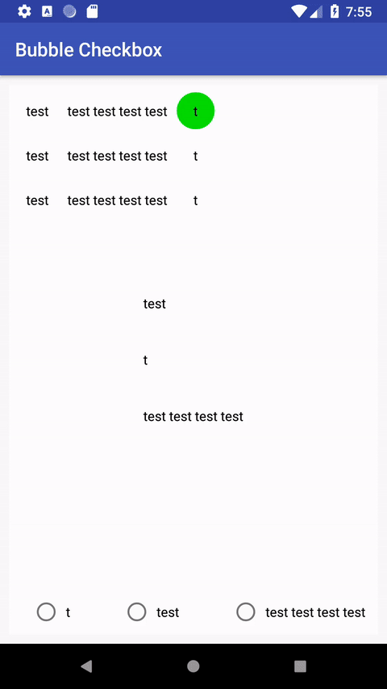

# Bubble-Checkbox

This library will display a drawable under a radiogroup, the drawable will be placed under the checked radiobutton and animated when the checked is changed.



## Usage

Import the lib :

```
dependencies {
    implementation 'com.alexandre.bubblecheckbox:bubbleradiogroup:0.2.0'
}
```

In your layout root element add :

```
xmlns:custom="http://schemas.android.com/apk/res/[your.package.name]"
```

Tehn create a BubbleRadioGroup as shown below :

```
<com.alexandre.bubbleradiogroup.ui.BubbleRadioGroup
        android:layout_width="wrap_content"
        android:layout_height="wrap_content"
        android:layout_marginBottom="8dp"
        android:layout_marginEnd="8dp"
        app:layout_constraintBottom_toBottomOf="parent"
        app:layout_constraintEnd_toEndOf="parent"
        custom:background="@drawable/bottom_black_line"
        custom:duration="50"
        custom:orientation="horizontal"
        custom:animation="classic">
        <RadioButton
            android:layout_width="wrap_content"
            android:layout_height="wrap_content"
            android:padding="5dp"
            android:text="@string/test"
            android:layout_marginEnd="50dp"/>

        <RadioButton
            android:layout_width="wrap_content"
            android:layout_height="wrap_content"
            android:padding="5dp"
            android:text="@string/test_test_test_test" />

</com.alexandre.bubbleradiogroup.ui.BubbleRadioGroup>
```

Custom parameters could to passed :

| Name 		 	| Type 										| Exampe 						| Description 															|
| ------------- | -----------------------------------------	| ----------------------------- | --------------------------------------------------------------------- |
| background  	| Drawable  								| @drawable/bottom_black_line 	| Drawable display under the radio button 								|
| duration  	| Int  										| 50 							| Animation time in milliseconds 										|
| orientation 	| horizontal or vertical 					| horizontal 					| Layout orientation 													|
| animation 	| none or classic or bounce or decelerate	| classic 						| Type of the animation none -> no animation, classic -> move animation, bounce and decelerate animation |

In order to detect which radiobutton has been selected you may create a listener
```
firstRadioGroup.setOnCheckedChangeListener { buttonView, isChecked ->
    Log.d("example", "buttonView : " + buttonView.id + "isChecked : " + isChecked)
}
```

Full examples are available in the file [MainActivity.kt](/app/src/main/java/com/alexandre/bubblecheckbox/MainActivity.kt)